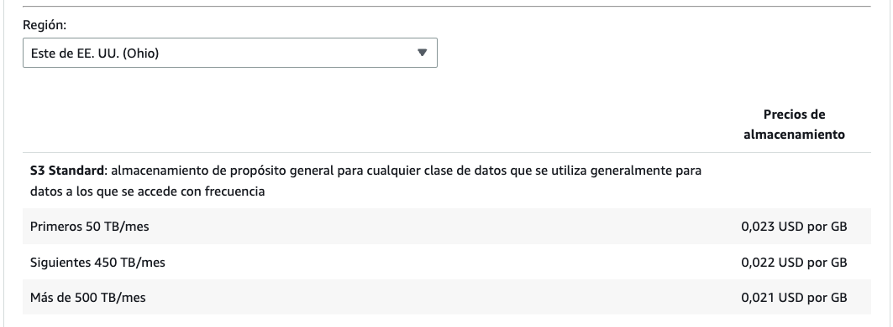
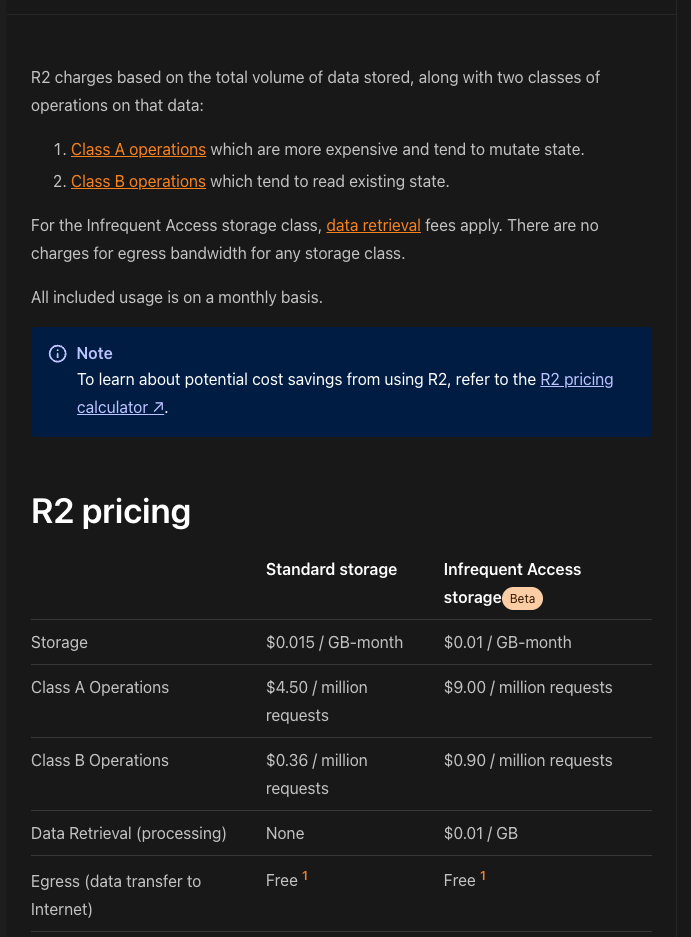
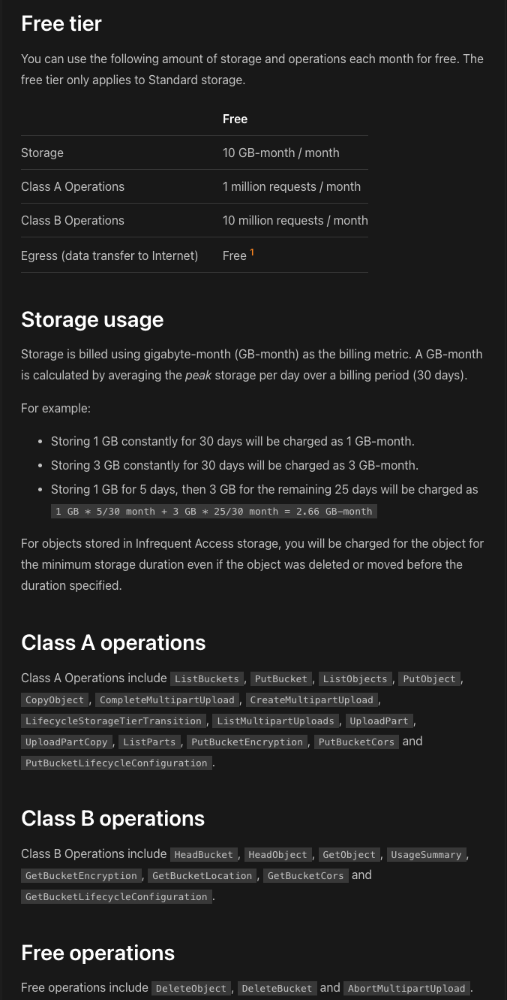

# [Done] Feature: S3 Image Loader

## Escenario BDD
```gherkin
Feature: Load S3 images
  Scenario: Open Landing Page
    When the visitante opens the Landing Page
    Then the page requests images from the images provider
```

## Opciones de módulo de carga de imágenes
### Amazon S3
Amazon Simple Storage Service (S3) ofrece almacenamiento de objetos con alta disponibilidad, seguridad y rendimiento. Permite escalar, organizar y proteger datos con controles de acceso detallados.

**Costos**



Referencias: Precios de S3.

### Cloudflare R2 Storage
Almacenamiento de objetos sin cargos de egreso elevados. Casos de uso: contenido web, podcasts, data lakes, salidas de procesos batch (p. ej. modelos ML).

**Costos**




Referencias: Pricing.

## Elección final
Se seleccionó S3 en AWS porque la infraestructura principal ya está en AWS y existe un ecosistema amplio de herramientas y soporte.

## Plan de implementación
- Cargar el frontend con un componente que consuma imágenes desde S3 de manera segura (en Next.js puede resolverse con configuración `.env`).
- Incluir token o mecanismo de seguridad si es necesario.
- Migrar la provisión de imágenes existentes al nuevo componente.
