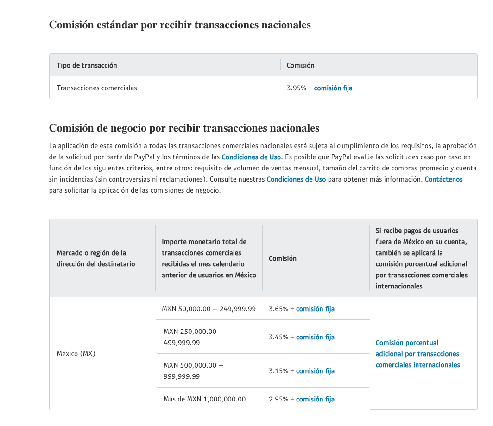
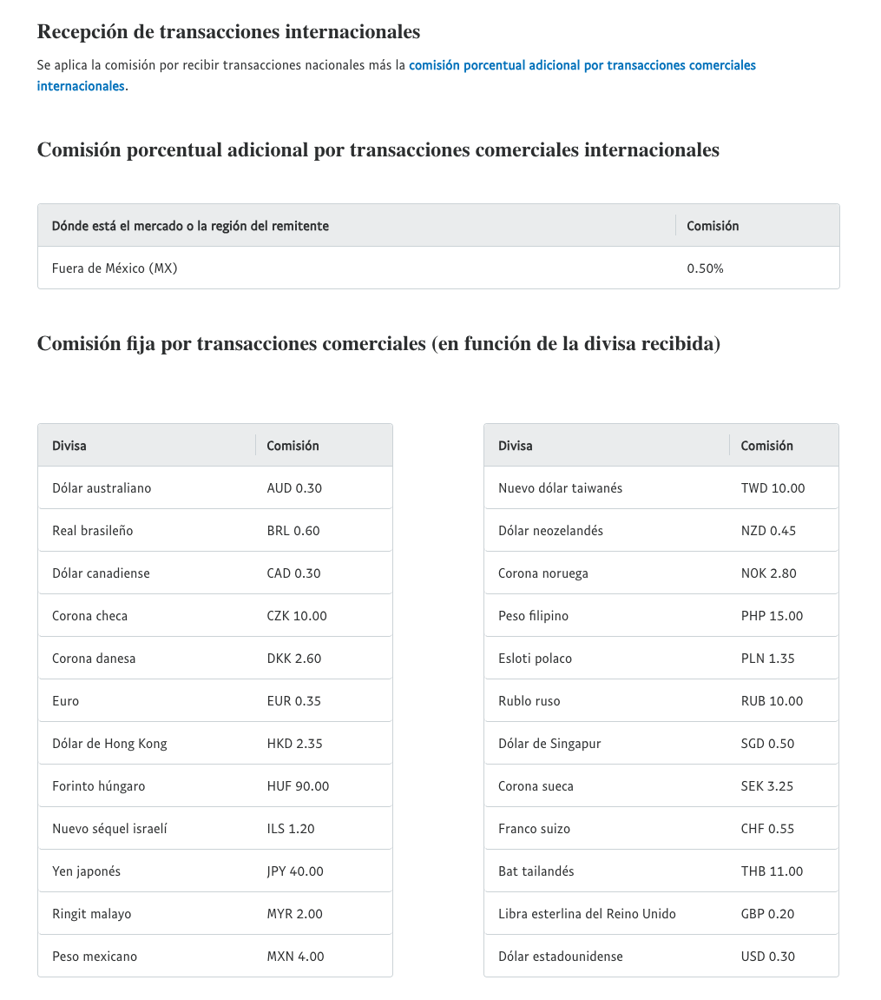
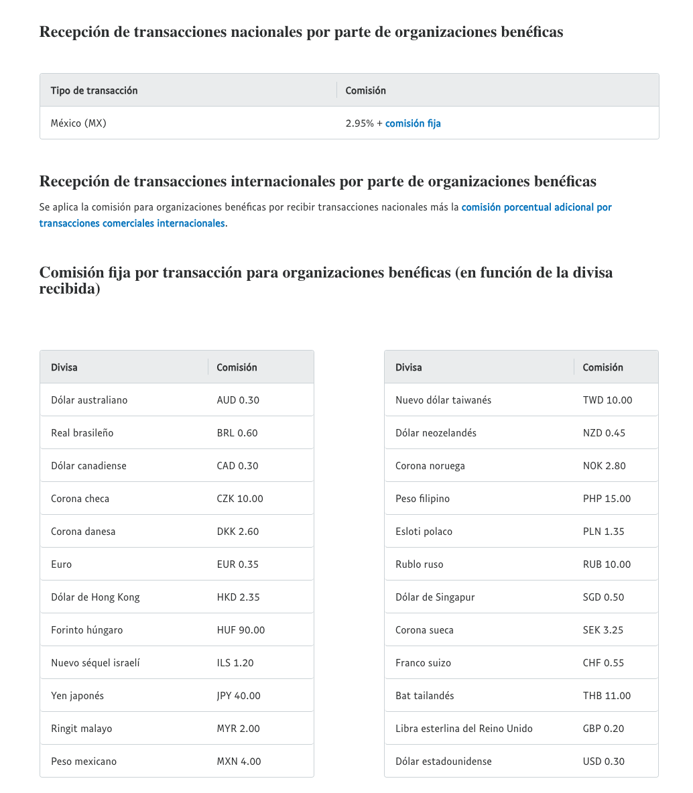
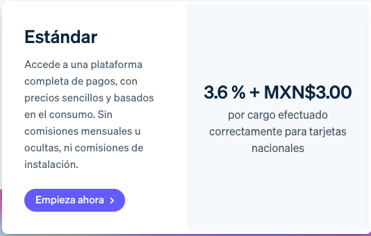

# Feature: Donaciones

## Resumen
La implementación de este módulo puede realizarse en diferentes etapas y en paralelo, priorizando mecanismos de captación de intención y escalando hacia procesamiento de pago y facturación cuando existan condiciones administrativas y bancarias.

## Alcance por etapa
### Formulario de Colaboraciones (implementado en esta etapa)
- Mecanismo de captación de información de interesados en apoyar a Ríos Vivos bajo tres vías:
  - Donativos en especie.
  - Donativos monetarios (captación de intención y rangos).
  - Voluntariado, alianzas y proyectos.
- Formulario para datos de contacto a donadores o benefactores (puede integrarse al flujo o quedar como subflujo independiente en etapas futuras).

### Flujo de Donación automatizado (etapa futura)
- Integración con pasarela externa para donaciones en línea.
- Uso de plataformas de donación o depósito (Stripe, PayPal o GoFundMe según estrategia institucional).
- Generación de facturas de donación ligada a requisitos fiscales formales y validación de donantes.

## Rules
- Los datos de contacto capturados desde el sitio público inician un flujo de comunicación manual para seguimiento institucional y pueden disparar una primera comunicación automatizada (opcional, sujeta a validación institucional).
- Usar correo institucional de Ríos Vivos para notificaciones relacionadas con donación y/o emisión de recibos.
- Los features Formulario de Colaboraciones y Donación automatizada deben ser XOR mediante feature flags para habilitar uno u otro en producción.
- La captura y consulta de datos de colaboraciones requiere autenticación en el sistema de administración.

## Requerimientos para iniciar proyecto
- **Formulario de Colaboraciones (etapa actual):**
  - Backend para almacenamiento y consulta de registros.
  - Base de datos para colaboradores/donadores potenciales.
  - Panel administrativo para seguimiento.
- **Donación automatizada (etapa futura):**
  - Cuenta bancaria institucional habilitada.
  - Cuentas verificadas en plataformas de donación.
  - Diseño del flujo automatizado.
  - Cumplimiento fiscal aplicable.
- **Facturación (etapa futura):**
  - Cuentas registradas ante el SAT (Servicio de Administración Tributaria).
  - Proceso institucional formal para emisión de recibos de donación.

## Entregables
### Implementados en esta etapa
- Flujo de formulario para contactos mediante la sección “Colaboraciones”, con rutas diferenciadas para donativo en especie, donativo monetario, voluntariado y alianzas/proyectos.
- Integración del flujo con el sistema administrativo para consulta y seguimiento institucional.

### Planificados para etapas posteriores
- Botón de donación automatizado (pasarela externa).
- Integración de plataformas de donación con Stripe como primera opción y PayPal como respaldo.
- Generación de facturas/recibos de donación.

## Elección final (actualizada)
Se había definido Stripe como primera opción por su simplicidad de integración mediante una pasarela externa basada en URL, agregando posteriormente PayPal como plataforma de respaldo. Este flujo no pudo implementarse en esta etapa debido a la restricción institucional de no contar con una cuenta bancaria habilitada para la asociación.

## Decisión de implementación en esta etapa
Se implementó como alternativa funcional el Formulario de Colaboraciones para:
- Mantener activo un canal de captación de apoyo.
- Obtener datos de contacto para seguimiento institucional.
- Clasificar la intención de ayuda por tipo de colaboración.
- Preparar la base operativa para la activación de donaciones automatizadas en una etapa posterior.

## Plan de implementación (actualizado)
- **Etapa actual:**
  - Implementación del formulario de colaboraciones y registro en base de datos.
  - Habilitación del acceso administrativo para consulta y seguimiento.
- **Etapa futura (condicionada):**
  - Creación y verificación de cuentas en Stripe/PayPal.
  - Habilitación de cuenta bancaria institucional.
  - Activación del feature flag para donación automatizada.
  - Implementación del flujo de recibos/facturación si aplica.

## Opciones de plataformas de donación (referencia técnica)
### PayPal
- Botón Donar apto para organizaciones benéficas; requiere confirmar la cuenta de organización en https://www.paypal.com/charities (se valida registro legal y representación).
- Sin comisiones mensuales ni de configuración; se paga solo comisión por procesamiento. Permite donativos mensuales y está optimizado para dispositivos móviles.

Referencias: “¿Cómo hago para aceptar donativos con PayPal? | PayPal MX”, “Charity Confirmation”.

### Stripe
- Donaciones únicas o recurrentes mediante Payment Links alojados en Stripe; se pueden compartir por correo/redes o integrar al sitio.
- Condiciones mínimas: propinas ligadas a un servicio prestado; donaciones ligadas a un fin benéfico concreto y conforme a leyes locales; Stripe no admite transmisión de dinero personal.
- Creación de enlace:
  - Iniciar sesión en el Dashboard, crear enlace de pago nuevo.
  - Elegir donación de importe fijo (producto nuevo, monto y recurrencia) o permitir que el donante elija el importe (con mínimos/máximos opcionales).
  - Ajustar llamada a la acción en opciones avanzadas, crear enlace y compartir URL o código QR.

Referencias: “Cómo aceptar donaciones mediante Stripe”; “Requisitos para aceptar propinas o donaciones”.

### GoFundMe
- Plataforma de crowdfunding sin comisión de inicio; cobra 2.9 % + USD 0.30 por transacción.
- Flujo base:
  - Crear la recaudación de fondos y objetivo.
  - Compartir el enlace para atraer donantes.
  - Registrar información bancaria propia o del destinatario para recibir fondos de forma segura (no es necesario alcanzar el objetivo para cobrar).
- Referencia: “Inicia un GoFundMe - Crea una recaudación de fondos de crowdfunding”.
