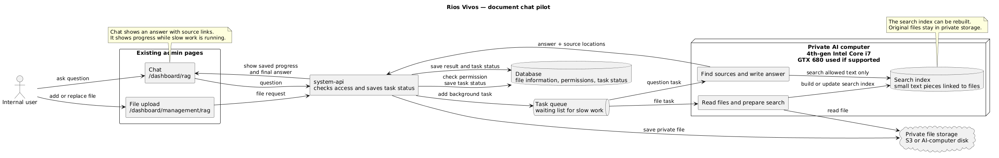
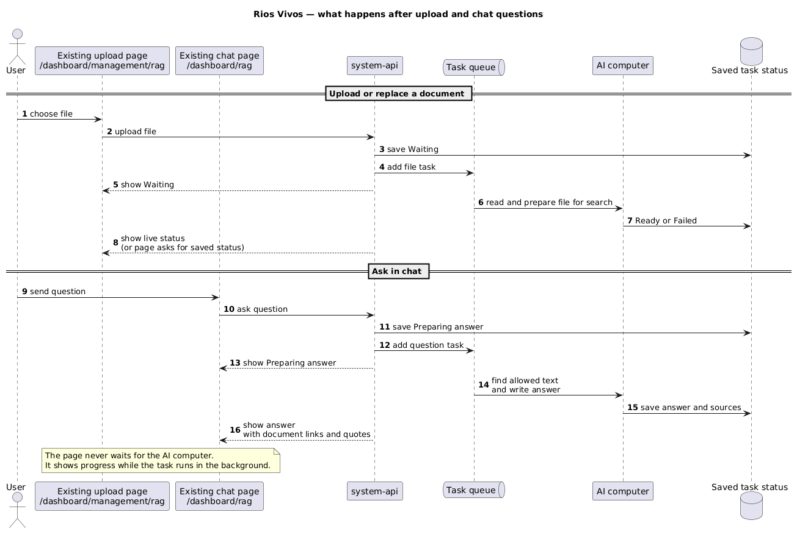

# Feature: Internal document chat pilot

**Status:** Proposal only. This document does not implement a feature.

**Source issue:** [RAG analysis #119](https://github.com/Rios-Vivos/web-page/issues/119).
The work belongs in `docs`; the future backend work belongs in `system-api`.

## Goal

Let internal Ríos Vivos users upload many environmental documents and ask about
them in a chat. Every answer must show the document, version, and page or text
part used for the answer. A user may only search documents that they are
allowed to open.

This is a pilot. It uses the computer already available: a fourth-generation
Intel Core i7 with a GTX 680. The GTX 680 is useful because it already exists,
but the pilot must work without depending on it. Results from the pilot decide
whether newer hardware is worth buying.

## Use the existing admin pages

No new admin screens are needed for the pilot.

| User need | Existing page | Pilot change |
| --- | --- | --- |
| Upload and manage documents | [`/dashboard/management/rag/`](https://admin.riosvivos.org/dashboard/management/rag/) | Keep this page as the place where users add, replace, and remove documents. Show the processing status for each file. |
| Ask about documents | [`/dashboard/rag/`](https://admin.riosvivos.org/dashboard/rag/) | Keep the current chat layout. A question may take time; show its status in the chat, then show the answer and source links. |

The checked `system-admin` code confirms that the first page uses
`MediaFileManagerView` and the second page reuses `ChatView`. The checked
`system-api` main branch has no RAG, local-model, or document-search backend
yet. The pages are the UI starting point, not proof that the feature works.

## Simple system picture

[Editable source for this diagram](../plantuml/rag-architecture.plantuml)

1. A user uploads a file in the existing management page, or sends a question
   in the existing chat.
2. `system-api` checks who the user is and what files they can access. It saves
   the task and returns quickly.
3. A queue is a waiting list for slow tasks. The AI computer takes the next
   task when it is ready.
4. For a file, the AI computer reads it and makes a **search index**: a fast
   list of small pieces of text linked to the original file and page.
5. For a question, it searches only the allowed pieces, then a local model
   writes an answer from those pieces.
6. The chat shows the answer plus links to the exact source documents. File
   and question progress are sent back to the page; after reconnecting, the
   page can also ask the API for the saved status.

The AI computer is private. It is not a public website and must only accept
work from `system-api` over an authenticated encrypted connection.

## What users see

[Editable source for this diagram](../plantuml/rag-async-workflow.plantuml)

| Action | What the user sees | Final result |
| --- | --- | --- |
| Upload or replace a file | `Waiting`, `Reading file`, `Preparing search`, then `Ready` | The file version is ready to search, or the page explains why it failed. |
| Remove a file | `Removing from search` | It can no longer appear in answers before its derived search data is deleted. |
| Ask in chat | The new chat message shows `Preparing answer` | An answer with source cards, or `I could not find support for this in the documents you can access.` |

WebSockets send live progress to an open page. The saved task status remains
the reliable record, so polling still works after a refresh or connection loss.

## Files, permissions, and sources

| Item | Pilot choice |
| --- | --- |
| Original files | Store them in one private place: either a private S3 bucket or encrypted disk on the AI computer. Do not make either location public. |
| File information | PostgreSQL stores the file name, owner, allowed users/roles, version, checksum, upload date, and task status. |
| Search index | Keep it on the AI computer. It is derived from the files and can be rebuilt; it is not the only copy of a file. |
| Source shown in chat | Each source card includes title, file version, page or section when available, a short supporting quote, and an authorized open/download link. |
| File update or removal | A new version creates a new background task. Removing access hides the file from search immediately, then deletes its derived text and search entries. |

`system-api` must check permission before creating a task and again when the
AI computer searches. Search results, chat answers, source quotes, status
events, and cached results must follow the same file permissions.

## Pilot model and machine

| Part | Pilot approach |
| --- | --- |
| Read files | Use the CPU to read PDF, Office, and text files. Run OCR for scanned pages as a background task. |
| Find text | Run a small multilingual model locally to create the search index. Test it with Spanish and the environmental terms used by Ríos Vivos. |
| Write answers | Run a small local model in a compressed format, one answer at a time. It may be slow; the queue and chat status handle that honestly. |
| GTX 680 | Try it only if the installed software supports it. NVIDIA classifies it as legacy CUDA compute capability 3.0 ([NVIDIA table](https://developer.nvidia.com/cuda/gpus/legacy)), so the pilot cannot rely on it. |

Before importing many files, confirm at least 16 GB usable RAM, enough healthy
SSD space for files, the search index, and backups, and safe temperatures
during a long task. Record real power use. If the pilot shows that answers or
file processing wait too long, use the same design with a newer GPU or CPU;
the chat and stored files do not need to change.

## Cost picture

The existing computer has no new purchase cost for the pilot. Its monthly power
cost is:

`watts ÷ 1,000 × 730 × local electricity price`

For example, 100 W at $0.15/kWh costs **$10.95 per month**. Measure the actual
number before using it for a budget.

For comparison only, an always-on AWS `g4dn.xlarge` cloud GPU reference at
$0.526/hour is about **$383.98/month** (`0.526 × 730`). It is faster hardware,
not an equal GTX 680 comparison; storage, backup, transfer, and operator time
are extra. Recheck the selected region before approval ([AWS G4
instances](https://aws.amazon.com/ec2/instance-types/g4/)).

Private S3 storage is also separate: at $0.023/GB-month, 100 GB is about
**$2.30/month** and 1 TB about **$23/month**, before requests, transfers, or
file versions ([AWS cost guide](https://docs.aws.amazon.com/es_es/cost-management/latest/userguide/cost-management-guide.pdf)).

The value of the in-house pilot is simple: it tests whether the existing
machine can answer the real internal workload before Ríos Vivos pays a monthly
cloud GPU bill or buys new hardware.

## Pilot checks

Start with a representative set of allowed environmental documents and 50
questions where reviewers know the supporting text.

- Every accepted answer must lead reviewers to the correct file, version, and
  supporting page or text part.
- A user without permission must not see a file name, quote, answer, task
  status, or source link for that file.
- Record upload time, processing time, queue wait, answer time, failed tasks,
  disk space, temperature, power, and backup/restore results.
- Reviewers rate whether the answer is useful and whether its sources really
  support it. An answer without support must say so.

Use those results to decide whether to keep the CPU-first host, add supported
hardware, or use cloud compute. Do not move to a broad import until the source
links, permission checks, backup, and measured cost are accepted.
