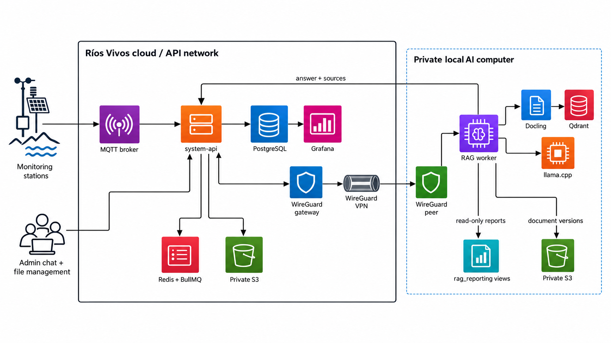
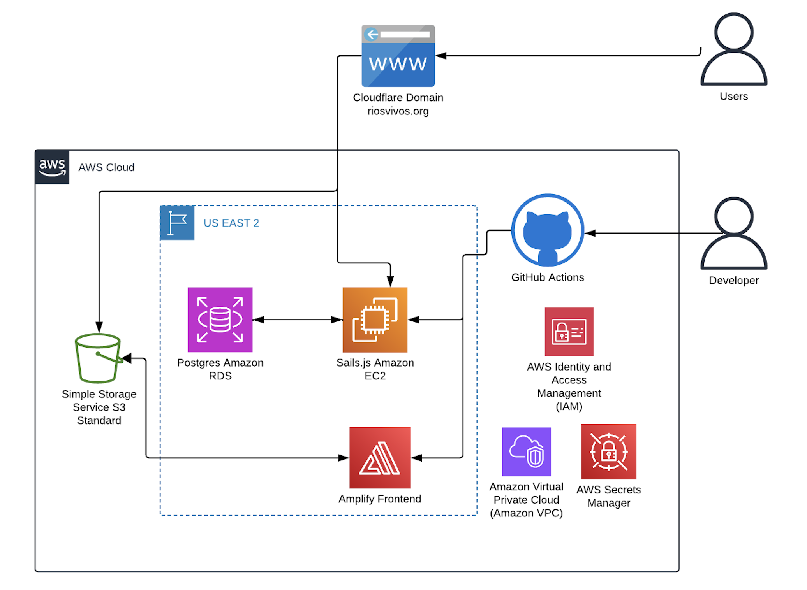
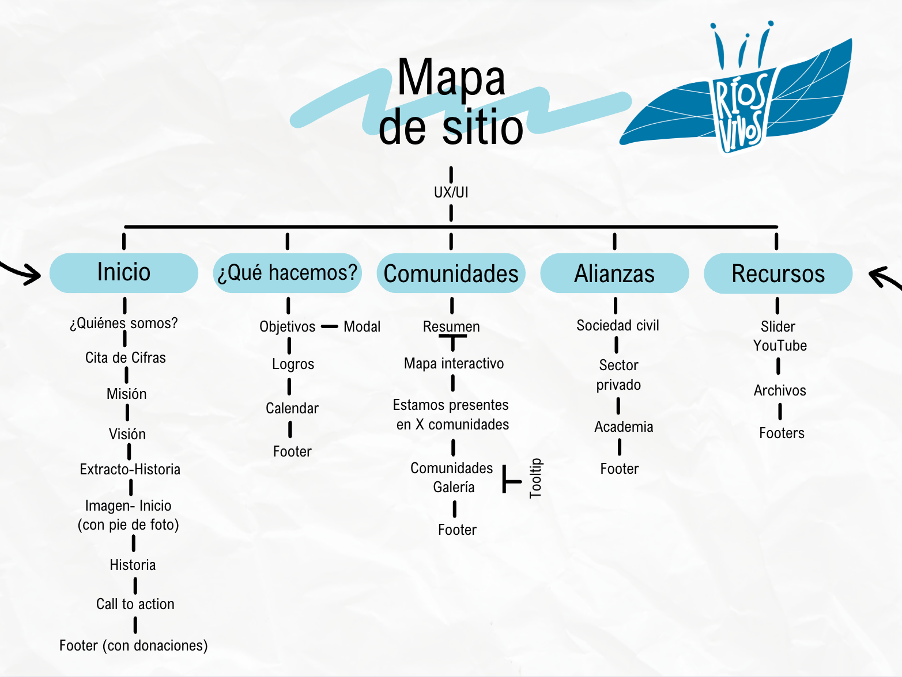
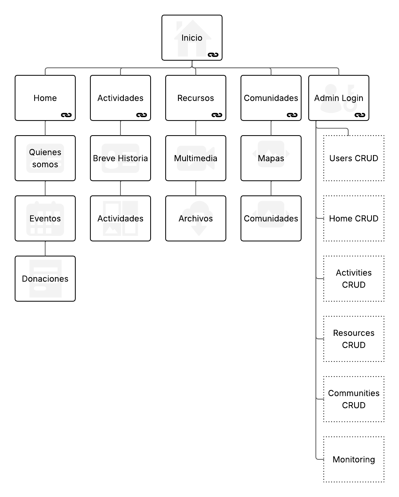
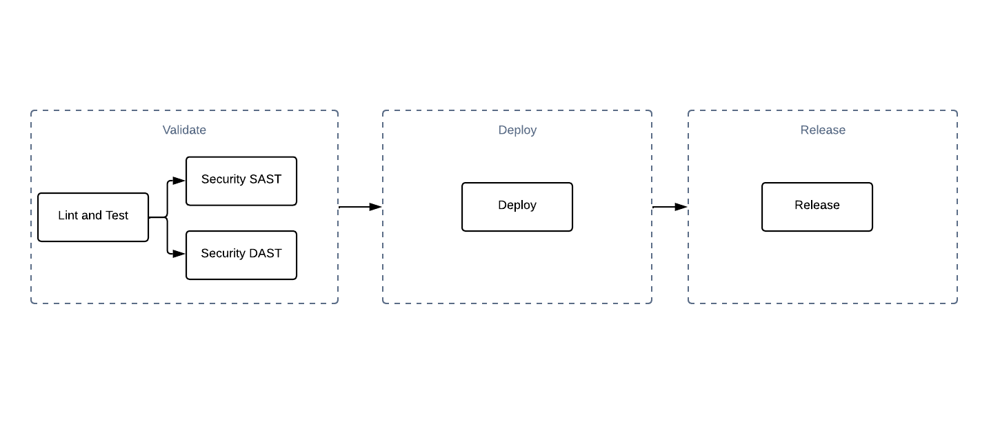

# Índice de Contenidos

## 1. [Introducción](#introducción)
   - 1.1 [Propósito](#propósito)
   - 1.2 [Vistazo del documento](#vistazo-del-documento)
   - 1.3 [Alcances del Proyecto](#alcances-del-proyecto)
   - 1.4 [Etapas](#etapas)
   - 1.5 [Roadmap del Proyecto](#roadmap-del-proyecto)

## 2. [Descripción General](#descripción-general)
   - 2.1 [Glosario](#glosario)
   - 2.2 [Versiones Futuras](#versiones-futuras)
   - 2.3 [Características de Publico Objetivo Pagina Web](#características-de-publico-objetivo-pagina-web)
   - 2.4 [Características de Publico Objetivo Admin](#características-de-publico-objetivo-admin)
   - 2.5 [Casos de Uso](#casos-de-uso)
   - 2.6 [Requerimientos no Funcionales](#requerimientos-no-funcionales)

## 3. [Especificacion de Requerimientos](#especificacion-de-requerimientos)
   - 3.1 [Stack Tecnologico](#stack-tecnologico)
   - 3.2 [Infraestructura actual](#infraestructura-actual)
   - 3.3 [Arquitectura de la pagina](#arquitectura-de-la-pagina)
   - 3.4 [Mitigación de Amenazas de Seguridad](#mitigación-de-amenazas-de-seguridad)
   - 3.5 [Herramientas externas](#herramientas-externas)
   - 3.6 [Costos](#costos)
   - 3.7 [Requerimientos Funcionales](#requerimientos-funcionales)

---

## Introducción

### Propósito

El propósito de este documento es presentar una descripción detallada del proyecto “Pagina Web Rios Vivos“. Este documento explicara el propósito de las características, las interfaces y las funciones que el sistema tendrá. También incluirá los limites sobre los que operará y como reaccionará ante actividades externas. Este documento está pensado para que ambos, stakeholders y los desarrolladores puedan desarrollar acuerdos sobre lo que será aprobado en el sistema.

### Vistazo del documento

En el siguiente capitulo, la sección de descripción general, nos da un vistazo sobre las funcionalidades del producto. Describe de forma informal los requerimientos y es usado para establecer contexto para los requerimientos técnicos en el siguiente capitulo.

En el tercer capitulo, la sección de especificación de requerimientos, es escrita principalmente para los desarrolladores y describe de manera técnica los detalles de la funcionalidad del producto. Ambas secciones del documento describen el producto de software de manera completa. Pero están pensado para audiencias diferentes y por lo tanto usan un lenguaje diferente.

### Alcances del Proyecto

El proyecto es una pagina web que pueda servir como Landing Page para la Asociacion Rios Vivos la pagina cumplira con distintas etapas, cada una integrando diferentes funcionalidades y interactividad en la pagina.

Esta pagina será diseñada para los que se quieran enterar de quienes son Rios Vivos, donadores, academicos y las comunidades que participan en esta Asociacion. El principal objetivo de la pagina es la recaudacion de donaciones en linea. Pero tambien se integrarán funcionalidades como la modificacion dinamica de la informacion en las vistas a traves de un panel de control, la actualizacion de datos de monitoreo, un sistema de comunicacion para las comunidades y un repositorio de informacion academica. En conjunto estas herramientas permitirán que la Asociacion pueda mantener una imagen institucional y adecuada para las personas que visitan su sitio.

### Etapas

| Etapa | Features | MVP | Pagina Presente |
|-------|----------|-----|-----------------|
| 0 | Boton de Donativos | | |
| 1 | Reorganizacion del Sitio | | |
| 2 | Cambio de Infraestructura | | |
| 3 | Monitoreo | | |
| 4 | Control del Sitio dinamicamente | | |
| 5 | Búsqueda de documentos con LLMs | | |
| 6 | Sistema de comunicación | | |
| 7 | Repositorio de información | | |

### Roadmap del Proyecto

El roadmap operativo y la trazabilidad con issues se mantiene en el
[catálogo de features](Features/README.md). El estado de una ficha representa
el comportamiento verificado o planificado; una issue cerrada no reemplaza la
verificación contra el repositorio dueño.

La sección “Etapas” conserva el plan histórico. Para conocer las capacidades
implementadas actualmente se debe usar el mapa de features implementadas en el
catálogo, no inferir estado a partir de esa tabla.

## Descripción General

### Glosario

Enlace al glosario [aqui](Glossary.md)

### Versiones Futuras

| Feature | Descripción |
|---------|-------------|
| Optimización de Sistema | Corrección y limpieza del sistema, mejoras en los procesos de desarrollo continuo y migracion a un servicio serverless para economizar la infraestructura. |
| Sistema de Comunicación | Se agrega la opcion de enviar articulos de opinion que puedan ser posteriormente agregados en un blog. |
| Repositorio de Información | Interfaz para la subida, descarga, busqueda y filtrado de documentos. |

### Características de Publico Objetivo Pagina Web

| User Type | Description | Feature Access |
|-----------|-------------|-----------------|
| Visitantes | Visitantes anonimos a la pagina web | |
| Donadores | Visitantes que quieren realizar donaciones al proyecto, en especie, servicios o economicas | |
| Academicos | Visitantes que requieren de visualizacion y descarga de documentos. Son miembros de la academia. | |
| Colaboradores | Miembros de Rios Vivos que pueden interactuar o cambiar informacion en la pagina. | |
| Comunidades | Comunidades aledañas al Rio Santiago | |
| Admin | Miembros tecnicos de Rios Vivos pueden acceder a los sistemas | |

### Características de Publico Objetivo Admin

| User Type | Description | Feature Access |
|-----------|-------------|-----------------|
| General | Primer registro, acceso a actividades básicas y principalmente de búsqueda. Sin edición de información | |
| Staff | Miembros autorizados por Rios Vivos para ejercer modificaciones en las paginas. | |
| Superadmin | Miembros de Rios Vivos con la autorización de hacer modificaciones en la configuración del sistema | |

### Casos de Uso

Vista general de los requerimientos, Use Cases. Lo hace el tester

| Use Case | Actor | Objetivo (Resumen) | Canal (Web/Admin/API) | Resultado de éxito |
|----------|-------|-------------------|----------------------|-------------------|
| UC-01 | Visitante público | Navegar Home/Actividades/Recursos/Comunidades y ver contenido publicado | Web → API | Contenido visible sin errores ni datos sensibles |
| UC-02 | Visitante público | Consultar recursos/descargas y paneles embebidos | Web → API | Acceso a recursos y vistas incrustadas sin exponer secretos |
| UC-03 | Visitante público | Enviar solicitud de colaboración/contacto (formulario) | Web → API | Registro creado y notificación para seguimiento |
| UC-04 | Admin/Editor | Iniciar sesión en dashboard | Admin → API | Sesión activa con rol aplicado y sesión segura |
| UC-05 | Admin/Editor | Recuperar contraseña / restablecer acceso | Admin → API | Token válido usado y contraseña cambiada |
| UC-06 | Admin/Editor | Gestionar contenido (CRUD Home, Actividades, Recursos, Comunidades) | Admin → API | Cambios guardados y reflejados en Web |
| UC-07 | Admin/Editor | Gestionar medios asociados al contenido | Admin → API → S3 | Archivo validado, almacenado y referenciado |
| UC-08 | Admin | Gestionar usuarios, roles y accesos | Admin → API | Usuario creado/actualizado con rol correcto y auditoría |
| UC-09 | Admin/Operador | Monitorear estaciones y métricas (Grafana/MQTT) | Admin → Grafana/API → MQTT/DB | Panel muestra datos actuales; alertas configuradas |
| UC-10 | Admin/Operador | Consultar logs y configuraciones del sitio | Admin → API | Logs filtrables y configs ajustadas con confirmación |

### Requerimientos no Funcionales

| Requirement | Quality Attribute | Brief Description |
|-------------|-------------------|-------------------|
| NFR 1 | Performance | The system is able to solve petitions under the 200ms |
| NFR 2 | Performance | The system is able to use caching strategies on frequently accessed data to improve performance |
| NFR 3 | Performance | The system is able to use database connection pooling to optimize PostgreSQL performance. |
| NFR 4 | Reliability | The system manage deployment rollbacks if a release causes issues. |
| NFR 5 | Reliability | The system perform automated database backups to prevent data loss. |
| NFR 6 | Reliability | The system uses automated CI/CD pipelines for testing and deploying new features. |
| NFR 7 | Maintainability | The system perform unit and integration tests before merging code to ensure quality. |
| NFR 8 | Usability | The system is able to work on a Web, mobile and ipad view |
| NFR 9 | Security | The system is able to encrypt and decrypt the communication between systems |
| NFR 10 | Security | The system is able to make secure authentication and authorization for API endpoints. |
| NFR 11 | Security | The system enforce API rate limiting to prevent abuse. |
| NFR 12 | Security | The system has environment-specific configurations for development, staging, and production. |

## Especificacion de Requerimientos

### Stack Tecnologico

| Categoria | Tecnologia | Justificación |
|-----------|------------|---------------|
| Framework Frontend | Next.js - React | Siendo un stack muy utilizado actualmente es facil encontrar información de su funcionamiento ademas de que existe mucho soporte. Es una de las herramientas que se enseñan en ITESO. |
| Lang Frontend | JS | Lenguaje utilizado ampliamente y enseñado en ITESO |
| CSS Framework | Tailwind | Permite el desarrollo sencillo de Frontend con clases preexistentes |
| Framework Backend | Sails.js | Framework MVC sencillo basado en JS, no es enseñado en ITESO pero delimita mucho la complejidad del sistema. |
| Lang Backend | TS | Similar a JS pero con la opción de agregar tipado de datos. Es enseñado en ITESO. |
| Base de Datos | PostgreSQL | Base de datos con soporte para JSONB, una base de datos sql muy capaz y con opciones extras que permiten adaptarse a las necesidades de la organización como plugins para geolocalización y herramientas de tiempo real. |
| IaC | Terraform | Se usa para automatizar la infraestructura, garantizar la consistencia entre entornos, gestionar recursos en múltiples nubes y aplicar el control de versiones a la infraestructura |

### Infraestructura actual

Diagrama de la infraestructura en AWS. Creada a través de Terraform.

| Servicio | Descripcion |
|----------|-------------|
| Github Actions | Servicio de GitHub que, integrado con AWS, automatiza el deploy de la página web cada vez que se actualiza el repositorio y ejecuta los workflows definidos (por ejemplo, build y deploy a Amplify). |
| Amplify | Servicio de AWS para administrar y hostear la página web de forma sencilla, manejando el build, deploy, hosting y versiones de la aplicación. |
| S3 | Servicio de AWS para almacenar archivos estáticos (como imágenes) y servirlos de forma rápida y altamente disponible, ideal para contenido de la web. |
| Cloudflare DNS | Servicio de DNS y registro de dominio que permite apuntar el dominio del proyecto (Ríos Vivos) al hosting y mejorar rendimiento y seguridad (CDN, protección DDoS). |
| IAM | Servicio de AWS para gestionar usuarios, roles y permisos finos sobre los distintos servicios de AWS, controlando quién puede hacer qué dentro de la cuenta. |
| VPC | Servicio de AWS para crear redes virtuales internas donde vive la infraestructura del proyecto, aislando recursos y controlando su acceso. |
| EC2 | Servicio de AWS para crear y administrar instancias de cómputo (máquinas virtuales) donde se pueden correr aplicaciones, servicios de backend u otros procesos. |
| RDS | Servicio de AWS para crear y operar bases de datos relacionales administradas (como MySQL, PostgreSQL), encargándose de backups, updates y alta disponibilidad. |
| Redis | Motor de base de datos en memoria tipo clave–valor, ideal para usar como caché, almacenamiento de sesiones o colas, reduciendo la carga de la base de datos principal y mejorando tiempos de respuesta. |
| SMTP | Protocolo estándar para el envío de correos electrónicos; se utiliza para que la aplicación pueda mandar correos de contacto, notificaciones o recuperación de cuenta. |
| Docker | Plataforma de contenedores que permite empaquetar la aplicación con todas sus dependencias en imágenes portables, facilitando despliegues consistentes entre entornos (dev, staging, producción). |

### Arquitectura de la pagina

Para tener un objetivo claro y reproducir el conocimiento de los productos, se comparten los siguientes diseños de la arquitectura del sitio.

#### Proposed architecture: monitoring and document-chat pilot

This proposal keeps the current monitoring path separate from the planned
document-chat path. Stations continue to send telemetry by MQTT to
`system-api`. The local AI computer is only for document and approved-report
jobs; it joins the API network through a private VPN. It does not replace the
MQTT broker, `system-api`, PostgreSQL, or Grafana.

#### Diagrama de infraestructura

#### Diagrama de sitio objetivo
Propuesta de sitio v2.

#### Sitio v1 (Outdated)

#### Diagrama de CI/CD
Aquí se detalla el proceso de CI/CD.

#### Diagrama de Base de datos
Aquí se detalla la definición de la base de datos con PlantUML.

[Database Diagram](plantuml/db.plantuml)

#### Mockups
Para definir los mockups utilizaremos Figma:

[Figma](https://www.figma.com/design/IHxVn6XNWDOlzsbPpP6x23/Sitio-riosvivos.org?node-id=0-1&t=svipedhnQEwFXSnM-1)

#### Diagrama de Seguridad
Aquí se detalla la definición de los riesgos de seguridad en el sitio.

[Security Diagram](plantuml/security.plantuml)

### Mitigación de Amenazas de Seguridad

Aquí se detallarán las posibles amenazas de seguridad y la manera en la que se mitigarán estas amenazas.

| Amenaza | Tipo de Amenaza | Mitigación |
|---------|-----------------|-----------|
| DOS/DDOS | Ataque | Configuración de ReCaptcha en el dominio |
| Vulneración de accesos | Hackeo | Politicas de manejo de contraseñas |
| Phishing | Hackeo | Filtros en correos |
| Ingeniería Social | Hackeo | Capacitación sobre seguridad digital |
| Amenazas internas | Errores humanos | Acceso basado en roles |

### Herramientas externas

| Plataforma | Link a la documentación |
|-----------|------------------------|
| Lucidchart | https://lucid.app/documents#/home?folder_id=recent |
| Gmail | https://gmail.com |
| Figma | https://www.figma.com/design/IHxVn6XNWDOlzsbPpP6x23/Sitio-riosvivos.org?node-id=0-1&t=svipedhnQEwFXSnM-1 |
| Confluence | https://riosvivos.atlassian.net/wiki/spaces/DDS/pages/131075 |
| Github | https://github.com/users/RiosVivos/projects/1/views/2 |
| Paypal | https://riosvivos.atlassian.net/wiki/spaces/DDS/pages/5407017/Feature+-+Donaciones#Paypal |
| Stripe | https://riosvivos.atlassian.net/wiki/spaces/DDS/pages/5407017/Feature+-+Donaciones#Stripe |
| Sails.js | https://sailsjs.com/ |
| Datagrip | https://www.jetbrains.com/es-es/datagrip/ |
| VS Code | https://code.visualstudio.com/ |
| Codex | https://openai.com/es-419/codex/ |
| Github Copilot | https://github.com/copilot |

### Costos

| Servicio | Descripción | Costo Mensual (MXN) | Costo Anual (MXN) |
|----------|-------------|-------------------|------------------|
| Dominio de Cloudflare | Anual | - | $138.00 |
| AWS | [AWS Calculator](https://calculator.aws/#/estimate?id=3cbc3c30293cb7a79f547f56488f719929075995) | $480.88 | $5,770.53 |
| Backend | Dev backend JS/TS (Sails.js / APIs / DB) jr | $18,000.00 | $216,000.00 |
| Frontend | Dev frontend Next.js/React jr | $17,000.00 | $204,000.00 |
| Devops | DevOps / CI-CD / AWS / Terraform jr | $20,000.00 | $240,000.00 |
| Infrastructure | Infra / sysadmin / cloud jr | $18,000.00 | $216,000.00 |
| Data Science | Data scientist jr (Python/SQL/ML básico) | $30,000.00 | $360,000.00 |
| Scrum Master | Scrum Master / facilitación ágil jr | $28,000.00 | $336,000.00 |
| Business Analyst | BA jr (levantamiento reqs / métricas / backlog) | $18,000.00 | $216,000.00 |

### Requerimientos Funcionales

Los requerimientos funcionales y su trazabilidad con issues se encuentran en el
[catálogo de features](Features/README.md). GitHub Projects gestiona la
priorización del trabajo, mientras que las fichas documentan alcance, reglas,
dependencias y criterios de aceptación durables.
